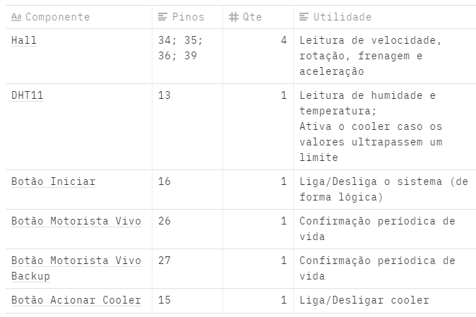

# **Pesquisa**

## **PWM - Pulse Width Modulation**

Uma forma de converter ondas analógicas em digitais, preocupando-se com a estabilidade e potência média da corrente. O sinal PWM é pulsado rapidamente de forma a representar um sinal analógico que irá controlar um motor, um autofalante ou qualquer outro componente analógico.

O sinal analógico, que possui infinitos valores dentro de um intervalo - (0v, 5v), por exemplo -, traduzido para PWM se torna um grande sinal digital com intervalos entre ligado e desligado.

> O PWM nada mais é do que uma maneira de codificar digitalmente níveis de sinal analógico. Nesta técnica, através do uso de contadores de alta resolução, o ciclo de trabalho de uma onda quadrada é modulado para codificar um nível de sinal analógico específico para que então ele atenda os requisitos de uma aplicação desejada.

> O tempo de ativação é o tempo durante o qual a alimentação CC é aplicada à carga e o tempo de desativação é o período durante o qual a alimentação é desligada. Dada uma largura de banda suficiente, qualquer valor analógico pode ser codificado com PWM.

Com "tempo de ativação" e "desativação", o texto se refere aos períodos em que o sinal digital está ligado ou desligado. Ativando e desativando o sinal num certo padrão específico, é possível reconstruir o sinal digital.


### **Duty Cycle**

Duty Cycle, ou "Ciclo de trabalho", é o nome dado ao método de alterar a corrente média que passa por um componente ao escolher intervalos diferentes de ligado/desligado.

Como o sinal digital é composto de períodos ativados e desativados, podemos aumentar ou diminuir os períodos de desativação, evitando que o componente fique ligado 100% do tempo. Um ciclo de 50%, por exemplo, seria um em que a corrente passa metade do tempo ligada e metade desligada. Um LED conectado a uma bateria de 9v e sujeito a um ciclo de 50% teria, na prática, uma corrente média de 4.5v.

A depender do componente que estamos controlando, a frequência do Duty Cycle pode ser maior, aumentando ainda mais a vida útil do componente. Dispositivos como um LED apagam rapidamente quando não há corrente passando, forçando-nos a usar uma frequência baixa. Por exemplo: para que o LED tenha um ciclo de 4.5V e não possua o efeito de "pisque" visível ao olho humano, poderíamos usar um intervalo de 50ms entre ativação e desativado, resultando em uma frequência de 10Hz

> A técnica de modulação é utilizada em dispositivos como o inversor de frequência no controle de motores elétricos sendo que neste caso, ele opera com eficiência em frequências acima de 20-30 kHz. Esta eficiência é conseguida porque a corrente (indução) nos enrolamentos do motor não colapsa completamente durante o curto período de desativação do PWM e este colapso leva uma certa quantidade de tempo que depende das especificações do motor. Seguindo este conceito, controlar motores elétricos em altas frequências de PWM mantém a corrente de indução em todo o processo de operação do motor, resultando em eficiências elevadas.


### **PWM gerando sinais analógicos**

Certo, já entendemos que o sinal analógico pode ser convertido em digital, inclusive aplicando um ciclo de trabalho que reduza a quantidade de tempo de ativação dos componentes. Mas o que fazer com esse sinal?

Primeiramente, o sinal digital pode ser manipulado mais facilmente por microcontroladores. Estes podem até já possuir um conversor PWM embutido. Além disto, o sinal analógico gerado depois possui uma blindagem muito maior a ruídos (valores analógicos distintos do que se esperam na onda), uma vez que o sinal digital varia apenas entre mínimo e máximo e, portanto, pequenos ruídos não possuem "força" suficiente para alterar o sinal de 0 para 1 ou vice-versa.

Após o devido processamento, o sinal pode ser passado adiante para que outro componente receba (como um autofalante que recebe o sinal processado de um microfone). Um convertor Digital-Analógico pode lidar com este trabalho interpretando o sinal PWM.


### **Fontes**

[https://www.citisystems.com.br/pwm/](https://www.citisystems.com.br/pwm/)


## **Teoria de Controle**

Uma forma de modelar de matematicamente todo o processo de construção de um sistema que se deseja controlar, seja este um circuito eletrônico, um programa de computador, um carro ou qualquer outro sistema que receba uma **entrada**, possua um **processamento** e gere uma **saída**. Este modelo é chamado **Sistema de controle**, ele é feito dentro da Matemática e aplicado na Engenharia.

Podemos pensar no sistema de um carro para exemplificar as partes da teoria.

### **Conceitos Básicos**

#### **Partes do sistema de controle**

É importante abstrair o sistema que se deseja controlar em partes de responsabilidade bem definida. São elas:

- **Variável de Controle**: a variável a ser controlada. Exmplo: a velocidade do carro;
- **Referência**: a saída desejada. Exemplo: o carro acelerar de forma consistente;
- **Entrada**: o conjunto de dados que é inserido no sistema de alguma forma, a fim de gerar a saída desejada. Exemplo: a pressão no pedal do acelerador, a aceleração e a velocidade atual;
- **Estado**: como as variáveis de controle estão se comportando durante o processamento. Exemplo: a velocidade mostrada no velocímetro no painel;
- **Dinâmica**: a derivada do estado; uma descrição de como o estado varia com o tempo. Exemplo: o carro está acelerando ou freiando;
- **Feedback**: o processo de ajustamento da entrada de acordo com a saída, a fim de alcançar a referência; Utilizado apenas em Malhas Fechadas;
- **Modelo**: a representação matemática do sistema; base para todo o projeto que será construído. Abstraindo os componentes do sistema e a forma como eles se comportam como uma equação matemática, podemos prever os estados possíveis. Exemplo: "Um carro pode ser expresso como um bloco de massa capaz de acelerar / desacelerar enquanto se move em uma superfície sob alguma equação de restrição";

#### **Objetivos**

Sendo uma abstração, o modelo pode seguir para diferentes direções se não dermos um escopo bem definido. Como queremos ter controle total sobre o sistema, devemos estabelecer objetivos fundamentais que, sendo atingindos, garantem seu bom funcionamento.

- **Estabilidade**: todo sistema estável relaciona a entrada e a saída de forma proporcional: se a entrada varia pouco, a saída varia pouco. Isto torna o funcionamento previsível: não esperamos que um carro corra a 100 km/h ao pisar um pouco no acelerador;
- **Rastreamento**: a habilidade do sistema de responder aos feedbacks para seguir de perto a referência; quanto mais rápido, mais eficiente. Isto signigica ler o estado e a dinâmica do sistema e ajustar a entrada o mais rápido possível. Imagine um carro ajustando a aceleração de acordo com a velocidade atual, para não exceder um limite máximo;
- **Rejeição a distúrbios**: uma proteção necessária que o sistema deve ter a ruídos de comunicação, isto é, sinais de entrada indesejados que podem possuir valores muito distoantes; Filtros e reconhecimentos de padrões podem ser utilizados para evitar que este tipo de sinal atrapalhe o sistema;
- **Robustez**: o quão resiliente o sistema é quando posto a mudanças no contexto. Um exemplo é verificar como um sistema de controle de velocidade de um carro se comportaria se a velocidade máxima fosse alterada, ou se um modelo diferente de carro fosse testado;
- **Otimização**: um sistema otimizado está no estado elevado de consciência. Aqui já sabemos que ele é estável, robusto, alcança rápido o sinal de referência e é resistente a ruídos. Agora a questão é: como nivelar corretamente os parâmetros do sistema pra que funcione melhor, de acordo com seu objetivo? Isto pode significar abrir mão de certas qualidades em prol de outras, ou buscar entender o que seria um sistema melhor dentro do seu escopo.

#### **Malhas abertas e fechadas**

Diz respeito à forma como o sistema se comporta ao gerar o sinal de saída. Ele vai apenas apresentar o resultado e encerrar? Ou vai sentir este sinal e tentar corrigí-lo? Estas duas situações caracterízam malhas **abertas** e **fechadas**, respectivamente.

Nas malhas **abertas**, o sistema irá encerrar sua execução após o final do processamento, entregando o resultado, seja ele o esperado ou não.

Podemos pensar numa máquina de lavar. Neste caso, teríamos a seguinte configuração:

- **Variável de Controle**: a sujeira das roupas, queremos removê-la;
- **Referência**: a saída desejada, as roupas limpas;
- **Entrada**: várias roupas sujas porque você esqueceu de lavar de novo;
- **Saída**: as mesmas roupas, porém lavadas e supostamente limpas;

Note que não há um **feedback** nem um **estado** aqui. Isto porque, ao final da lavagem, você mesmo, humano, tem que tirar as roupas e estendê-las, verificando antes que misturou roupas coloridas com brancas e manchou tudo. Por mais que o resultado tenha sido diferente do desejado, a máquina é uma malha aberta e não possui sensores que detectem isso, ficando ao seu encargo.

Já nas malhas **fechadas** o feedback é essencial para que o sistema automatize o processo de checagem do sinal de saída, realimente o controlador e rastreie um sinal de referência

Esta "função a mais" é o que "fecha" o sistema, tornando-o cíclico. Para isto são utilizados sensores que medem o sinal de saída e enviam esse valor de volta para o sistema, como sinal de realimentação.

Um chuveiro elétrico pode exemplificar isto:

- **Variável de Controle**: a temperatura da água;
- **Referência**: uma temperatura agradável ao corpo humano;
- **Entrada**: a temperatura da água ao abrir o chuveiro;
- **Estado**: informações gerais sobre o chuveiro (nível da água no reservatório, corrente elétrica disponível etc), captadas por sensores;
- **Saída**: a água numa determinada temperatura;
- **Feedback**: "Eita água quente da peste" ou "Mds que friooo"

Nessa relação humano-chuveiro, quem sente o sinal de saída é o humano com sua pele, e consequentemente também ajusta a temperatura. Um sistema de controle visa automatizar a parte do humano, mas aí já é outro assunto. O importante aqui é que o sistema possui um feedback bom ou ruim a depender da saída, comparando com a referência. Este feedback permite que a temperatura seja ajustada "ao vivo", isto é, enquanto o processo todo acontece.

#### **Realimentação (feedback)**

> Um sistema é realimentado quando o sinal de saída influencia o sinal de entrada

Há duas formas de realimentar um sistema: negativa e positiva.

**Realimentação negativa** é quando o objetivo é a regulação do sinal de entrada. Este é o modo mais utilizado. Digamos que temos um sistema de ar-condicionado e queremos atingir uma certa temperatura ambiente. Quando ligamos o aparelho, queremos que ele esfrie o ar até que a temperatura seja atingida, onde ele passa a apenas regular as pequenas variações naturais (como quando entra uma nova pessoa e o ar esquenta um pouco). Neste caso, é essencial uma realimentação por meio de sensores para que, ao aproximar-se da referência, o sistema mude seu comportamento e não continue a esfriar rumo aos 0ºC. Esta realimentação é chamada negativa pois regula o funcionamento do sistema.

A **realimentação positiva** é geralmente desestabilizadora, pois icrementa o sinal de entrada conforme este também aumenta. O exemplo mais fácil é uma caixa de som perto de um microfone, ligados no mesmo sistema. Conforme o autofalante gera ondas de som, o microfone capta essas ondas e transmite ao autofalante. Novamente o som é transmitido, captado e retransmitido. Isto se segue até que um ator externo interrompa a realimentação, e é conhecido como microfonia - um sinal agudo que aumenta a cada segundo.

Este tipo de feedback pode bagunçar o sistema e deve ser usado com cautela e formas de impedir que algo como a microfonia aconteça.

### **Diagrama de Blocos**

Tendo os conceitos básicos de um sistema de controle, é possível montar um diagrama que seja fácil de entender e construir.

Ele geralmente terá este formato:


Onde cada bloco tem o seu papel no sistema, são eles:

- **Sinal de entrada**: o valor utilizado para iniciar o sistema. Este pode ser um valor de referência, como a temperatura desejada no chuveiro elétrico, ou um valor que será transformado em outro, como roupas sujas que entram numa máquina de lavar e saem limpas;
- **Controlador**: é de onde sairão as instruções do sistema, tendo como objetivo o valor de referência
- **Sinal de Controle**: instruções enviadas pelo controlador para o atuador;
- **Atuador**: é o bloco responsável por receber ordens do controlador, alterando o estado da variável de controle para que se tenha a saída desejada;
- **Sistema** ou **Planta**: diz respeito a toda a instalação do sistema. Por exemplo: no caso do chuveiro elétrico, a planta seria a instalação hidráulica e elétrica que faz a água sair da bomba até o banheiro. **OBS:** muitas vezes, o **atuador** pode ser incorporado dentro da planta, uma vez que ambos são manipulados pelo controlador de uma forma ou de outra;
- **Sinal de Saída**: como explicado nos conceitos básicos, é o resultado do processamento do valor de entrada, como a água saindo do chuveiro ou as roupas limpas da máquina de lavar;
- **Sensor**: este, assim como o **sinal de realimentação**, está presente apenas em sistemas de [malha fechada](https://www.notion.so/Conceitos-b-sicos-69020b88d62044b8aad9f70bc4ffad92), onde há um feedback constante para que o sinal de saída seja alcançado;
- **Sinal de realimentação**: o valor enviado pelo sensor para realimentar o sistema.

#### **Distúrbios**

Há ainda um ator muito importante nessa história: os **distúrbios**, **externos** ou **internos**. São sinais que entram no sistema, de uma forma ou de outra, sem serem desejados. Todo sistema está sujeito a distúrbios. Você abrindo a porta da geladeira é um distúrbio externo para o sistema de resfriamento automático. Raios cósmicos penetrando a atmosfera a milhares de km/h são distúrbios ao processador do seu computador que muitas vezes causam a tela azul da morte. Eles sempre estarão lá, não importa o sistema.

#### **Nomeclatura**

O diagrama de blocos é usado para descrever um modelo matemático do sistema. Portanto, é importante reconhecer cada ator do diagrama como uma função com nome próprio.


- ***R(s)***: Referência
- ***C(s)***: Controlador
- ***G(s)***: Planta
- ***Y(s)***: Sinal de saída
- ***H(s)***: Sensor
- ***X(s)***: Sinal de realimentação
- ***Ea(s)***: Erro de acionamento = diferença entre ***R(s)*** e ***X(s)***
- ***M(s)***: Sinal de controle;
- ***W(s)***: Sinais de distúrbio

### **Fontes**

[https://www.youtube.com/playlist?list=PLALrL4i0Pz6CfqappJPo-45HZj0AavVyO](https://www.youtube.com/playlist?list=PLALrL4i0Pz6CfqappJPo-45HZj0AavVyO)

[https://ichi.pro/pt/teoria-de-controle-para-leigos-255504747154175](https://ichi.pro/pt/teoria-de-controle-para-leigos-255504747154175)

[https://www.youtube.com/watch?v=neYCp5JoYV0](https://www.youtube.com/watch?v=neYCp5JoYV0)

[https://www.youtube.com/watch?v=IYtFhcIf-Xc](https://www.youtube.com/watch?v=IYtFhcIf-Xc&ab_channel=Eng.LuisCesarEmanuelli)


# **Componentes**

## Microcontrolador: ESP32 WROOM-32


## Inputs



## Outputs


## Helpers


# **Código**

```c++
/************************************************************/
/*                         INCLUDES                         */
/************************************************************/

#include <Metro.h>                // biblioteca para facilitar multitasking

#include <SPI.h>                  // protocolo de comunicação SPI (display oled)
#include <Wire.h>                 // protocolo de comunicação I2C (display oled)
#include <Adafruit_GFX.h>         // display oled
#include <Adafruit_SSD1306.h>     // display oled

#include <DHT.h>                  // Temp/Humi DHT11

#include <driver/i2s.h>           // Microfone INMP441

/*************************************************************/
/*                         DIRETIVAS                         */
/*************************************************************/

/********************* Entradas e saídas *********************/

// botão de ligar/desligar o sistema
#define BTN_INICIAR       16

#define HALL_ACELERACAO   39
#define HALL_FRENAGEM     36
#define HALL_ROTACAO      34
#define HALL_VELOCIDADE   35

#define SENSOR_DHT        13

#define BTN_RESFRIAMENTO  15
#define COOLER            19

#define OLED_SCL          22 // pino I2C SCL
#define OLED_SDA          21 // pino I2C SDA
#define OLED_RESET        -1 // pino reset (-1 caso o display não possua)


// botões de confirmação de vida
#define BTN_CONFIRMAR_VIDA          26
#define BTN_CONFIRMAR_VIDA_BACKUP   27

// leds de alerta
#define LED_ALERTA_CONFIRMACAO      14
#define LED_ALERTA_INATIVIDADE      12
#define LED_ALERTA_ERRO_INTERNO     2

// buzzer para alertas gerais
#define BUZZER                      4

/************************* Constantes *************************/

#define DHT_TYPE          DHT11

#define TEMP_MAX          30 // °C
#define HUMD_MAX          90 // % 

#define VELOCIDADE_COOLER 100

// tamanho da tela do display oled
#define SCREEN_WIDTH      128 // px
#define SCREEN_HEIGHT      64 // px

// códigos de erro interno, representando o número de beeps a tocar
#define CODIGO_ERRO_DISPLAY 3
#define CODIGO_ERRO_DHT     5


/** 
 * DIRETIVAS DE CHECAGEM DE VIDA DO MOTORISTA
 * ------------------------------------------
 * A cada 4min30s é iniciado o alerta de confirmação
 * de vida pendente. Durante os próximos 30s, um alerta
 * é emitido. Passados 5 min ao total e o botão de confirmação
 * não tiver sido pressionado, todo o sistema é interrompido
 */

// intervalo de checagem de inatividade do motorista
#define SYSTEM_INTERRUPT_TIMEOUT    1000 * 60 * 5   // 5 min

// intervalo entre os alertas de checagem de inatividade
#define LIFE_CHECK_ALERT_DELAY      1000 * 60 * 4.5 // 4min30s

// intervalo entre os beeps de alerta da próxima checagem
#define LIFE_CHECK_ALERT_BEEP_DELAY 300

/**
 * FIM DIRETIVAS DE CHECAGEM DE VIDA DO MOTORISTA
 * ----------------------------------------------
 */

/************************************************************/
/*                    VARIÁVEIS GLOBAIS                     */
/************************************************************/

// objetos utilizados para controlar tarefas paralelas
// define um intervalo em ms para execução de processos
Metro taskBotaoMicrofone = Metro(500);        // 0.5 s
Metro taskBotaoCooler = Metro(500);           // 0.5 s
Metro taskAtualizarVelocidade = Metro(50);    // 50 ms
Metro taskChecarTemperatura = Metro(1000);    // 1 s
Metro taskMostrarDadosDisplay = Metro(200);   // 0.2 s

// timestamp utilizado para controle do alerta de checagem de vida
// escolhido ao invés do Metro para obter maior controle sobre a tarefa
unsigned long int tsLifeCheckAlert = millis();
unsigned long int tsToggleAlert = millis();
unsigned long int tsSystemInterruptTimeout = millis();

// Display oled
Adafruit_SSD1306 display(SCREEN_WIDTH, SCREEN_HEIGHT, &Wire, OLED_RESET);

// array bitmap do ícone de cooler mostrado no display
static const PROGMEM uint8_t coolerIcon[16 * 16 / 8] = { 
  0x03, 0x00, 0x0F, 0x10, 0x0F, 0x3C, 0x0F, 0x7E, 0x47, 0x7C, 0xF7, 0xF0, 0xFF, 0xE0, 0xFE, 0x7E,
  0x7E, 0x7F, 0x07, 0xFF, 0x0F, 0xEF, 0x3E, 0xE2, 0x7E, 0xF0, 0x3C, 0xF0, 0x08, 0xF0, 0x00, 0xC0
};

// array bitmap do ícone de microfone mostrado no display
static const PROGMEM uint8_t micIcon[16 * 16 / 8] = { 
  0x1C, 0x00, 0x3E, 0x00, 0x3E, 0x00, 0x3E, 0x00, 0x3E, 0x00, 0x3E, 0x00, 0x3E, 0x00, 0xBE, 0x80,
  0xBE, 0x80, 0xBE, 0x80, 0xDD, 0x80, 0x63, 0x00, 0x3E, 0x00, 0x08, 0x00, 0x08, 0x00, 0x3E, 0x00
};

// array bitmap do ícone de coração (confirmação de vida pendente) mostrado no display
static const PROGMEM uint8_t lifeIcon[16 * 16 / 8] = { 
  0x1C, 0x00, 0x3E, 0x00, 0x3E, 0x00, 0x3E, 0x00, 0x3E, 0x00, 0x3E, 0x00, 0x3E, 0x00, 0xBE, 0x80,
  0xBE, 0x80, 0xBE, 0x80, 0xDD, 0x80, 0x63, 0x00, 0x3E, 0x00, 0x08, 0x00, 0x08, 0x00, 0x3E, 0x00
};

// sensor de temperatura e humidade
DHT dht(SENSOR_DHT, DHT_TYPE);

// variáveis de estado (guardam o valor dos sensores)
int isSistemaLigado = 0;

int isCoolerAtivo = 0;

int isMicrofoneAtivo = 0;

int isConfirmacaoVidaPendente = 0;

float temperaturaAtual = 0;

float humidadeAtual = 0;

float aceleracaoAtual = 0;

float frenagemAtual = 0;

float velocidadeAtual = 0;

float rotacaoAtual = 0;

/************************************************************/
/*                FUNÇÕES DE BAIXO NÍVEL                    */
/*             -----------------------------                */
/*             Controlam e ditam a lógica de                */
/*             funcionamento dos componentes                */
/************************************************************/

/** Configura a utilização dos pinos do Arduino */
void configurarPinos() {
  pinMode(BTN_INICIAR, INPUT);

  pinMode(HALL_ACELERACAO, INPUT);
  pinMode(HALL_FRENAGEM, INPUT);
  pinMode(HALL_ROTACAO, INPUT);
  pinMode(HALL_VELOCIDADE, INPUT);

  pinMode(BTN_RESFRIAMENTO, INPUT);
  pinMode(COOLER, OUTPUT);

  // pinMode(LED_BTN_FALA, OUTPUT);
  // pinMode(BTN_FALA, INPUT);
  // pinMode(PLAYER, OUTPUT);

  pinMode(BTN_CONFIRMAR_VIDA, INPUT);
  pinMode(BTN_CONFIRMAR_VIDA_BACKUP, INPUT);

  pinMode(LED_ALERTA_INATIVIDADE, OUTPUT);
  pinMode(LED_ALERTA_CONFIRMACAO, OUTPUT);
  pinMode(LED_ALERTA_ERRO_INTERNO, OUTPUT);
  
  pinMode(BUZZER, OUTPUT);

  dht.begin();
}

void inicializarDisplay() {
  if(!display.begin(SSD1306_SWITCHCAPVCC, 0x3C)) { 
    alertarErroInterno(CODIGO_ERRO_DISPLAY);
  }

  display.clearDisplay();
  display.setTextColor(WHITE);
}

/* ====================================
 * Funções que guardam a lógica de
 * ativação/desativação dos componentes
 * ==================================== */

void ligarCooler() {
  isCoolerAtivo = 1;
  analogWrite(COOLER, VELOCIDADE_PADRAO_COOLER);
}

void desligarCooler() {
  isCoolerAtivo = 0;
  analogWrite(COOLER, LOW);
}

/**
 * Lê o estado de um push button, recebendo seu pin como parâmetro
 * Impede de ler mais de um valor caso o botão continue pressionado
 */
int lerEstadoBotao(int pin) {
  int estado = digitalRead(pin);
  
  // se o botão foi pressionado, suspende
  // o programa até que seja solto
  while (digitalRead(pin) == HIGH) {
    delay(100);
  }
  
  return estado;
}

/** Lê o valor de um pino como analógico e o retorna convertido para digital */
float getValorAnalogicoDigital(int pin) {
  // Lê o valor analógico do potenciômetro,
  // que varia entre 0 e 1023
  int valorAnalogico = analogRead(pin);

  // Mapeia o valor analógico para digital
  return valorAnalogico * 5 / 1023.0;
}

/** Envia o comando de desligar a todos os componentes */
void desligarComponentes() {
  desligarCooler();

  isMicrofoneAtivo = 0;
  digitalWrite(LED_BTN_FALA, LOW);

  digitalWrite(LED_ALERTA_ERRO_INTERNO, LOW);
  digitalWrite(LED_ALERTA_CONFIRMACAO, LOW);
  digitalWrite(LED_ALERTA_INATIVIDADE, LOW);

  noTone(BUZZER);

  display.clearDisplay();
}


/************************************************************/
/*                    FUNÇÕES DE COMANDO                    */
/*                    -------------------                   */
/*           Determinam a lógica de funcionamento           */
/************************************************************/


/** Faz a leitura dos sensores de velocidade e atualiza as variáveis */
void atualizarVelocidade() {
  // verifica se é hora de checar os sensores de velocidade
  if (taskAtualizarVelocidade.check()) {
    velocidadeAtual = getValorAnalogicoDigital(HALL_VELOCIDADE);
    rotacaoAtual = getValorAnalogicoDigital(HALL_ROTACAO);
    aceleracaoAtual = getValorAnalogicoDigital(HALL_ACELERACAO);
    frenagemAtual = getValorAnalogicoDigital(HALL_FRENAGEM);
  }
}

/** Faz a leitura dos sensores de temperatura e liga/desliga o cooler de acordo */
void checarTemperatura() {
  if (taskChecarTemperatura.check()) {
    temperaturaAtual = dht.readTemperature();
    humidadeAtual = dht.readHumidity();

    if (isnan(temperaturaAtual) || isnan(humidadeAtual)) {
      alertarErroInterno(CODIGO_ERRO_DHT);
    }

    // se o cooler não já estiver ativo
    if(!isCoolerAtivo) {
      // verifica se a temperatura excedeu o limite máximo
      if (temperaturaAtual >= TEMP_MAX || humidadeAtual >= HUMD_MAX) {
        ligarCooler();
      } else {
        desligarCooler();
      }
    }
  }
}

/** Verifica se o botão de resfriamento foi acionado */
void checarBotaoCooler() {
  if (taskBotaoCooler.check()) {
    // Checa se o botão Cooler foi pressionado
    int isBotaoCoolerOn = lerEstadoBotao(BTN_RESFRIAMENTO);

    // se o botão foi pressionado, troca o estado do cooler
    if (isBotaoCoolerOn)
      isCoolerAtivo = !isCoolerAtivo;

    if (isCoolerAtivo)
      ligarCooler();
    else
      desligarCooler();
  }
}

/** Desliga os componentes que alertam que a confirmação de vida está pendente */
void desligarAlertaConfirmacao() {
  isConfirmacaoVidaPendente = 0;
  digitalWrite(LED_ALERTA_CONFIRMACAO, LOW);
  noTone(BUZZER);
}

/** Beepa repetidamente para alertar que a confirmação de vida está pendente */
void alertarAguardandoConfirmacao() {
  isConfirmacaoVidaPendente = 1;

  if (millis() - tsToggleAlert < LIFE_CHECK_ALERT_BEEP_DELAY) {
    digitalWrite(LED_ALERTA_CONFIRMACAO, HIGH);
    tone(BUZZER, 440, LIFE_CHECK_ALERT_BEEP_DELAY);
  } else {
    digitalWrite(LED_ALERTA_CONFIRMACAO, LOW);
    noTone(BUZZER);
  }
  
  if (millis() - tsToggleAlert > LIFE_CHECK_ALERT_BEEP_DELAY * 2) {
    tsToggleAlert = millis();
  }
}

/** Liga os componentes que alertam a inatividade do motorista */
void alertarInatividade() {
  digitalWrite(LED_ALERTA_INATIVIDADE, HIGH);
  tone(BUZZER, 550);
}

/** Suprime os alertas de inatividade do motorista */
void desligarAlertaInatividade() {
  digitalWrite(13, LOW);
  noTone(BUZZER);
}

/** Verifica sinais vitais do motorista e dispara o alerta de inatividade */
void checarVidaMotorista() {
  // a cada X segundos, começa o alerta de aguardando confirmação
  if (millis() - tsLifeCheckAlert >= LIFE_CHECK_DELAY) {
    // aguarda a confirmação de vida
    int isMotoristaVivo = digitalRead(BTN_CONFIRMAR_VIDA);
    int isMotoristaVivobBackup = digitalRead(BTN_CONFIRMAR_VIDA_BACKUP);

    // quando o motorista confirmar que está vivo...
    if (isMotoristaVivo || isMotoristaVivobBackup) {
      // atualiza os intervalos e desliga os alertas
      tsLifeCheckAlert = millis();
      tsSystemInterruptTimeout = millis();

      desligarAlertaConfirmacao();
      desligarAlertaInatividade();
    }
    
    // se o motorista excedeu o tempo de confirmação...
    else if (millis() - tsSystemInterruptTimeout >= SYSTEM_INTERRUPT_TIMEOUT) {
      desligar();           // encerra os processos do sistema
      alertarInatividade(); // alerta a inatividade do motorista
    }

    // se ainda está no intervalo de espera de confirmação...
    else {
      alertarAguardandoConfirmacao();
    }
  }
}

/** Inicia os processos do módulo Segurança */
void checarSeguranca() {
  checarVidaMotorista();
  checarTemperatura();
  checarBotaoCooler();
}

/** Apresenta as variáveis de controle no display oled */
void mostrarDadosNoDisplay() {
  if (taskMostrarDadosDisplay.check()) {
    display.clearDisplay();
  
    // temperatura
    display.setTextSize(1);
    display.setCursor(0,0);
    display.print("Temp ");
    display.write(167);
    display.print("C");
    display.setTextSize(2);
    display.setCursor(0,10);
    display.print(temperaturaAtual);
    
    // humidade
    display.setTextSize(1);
    display.setCursor(65, 0);
    display.print("Hum %");
    display.setTextSize(2);
    display.setCursor(65, 10);
    display.print(humidadeAtual);
    
    // velocidade
    display.setTextSize(1);
    display.setCursor(0, 32);
    display.print("Vel Km/h");
    display.setTextSize(2);
    display.setCursor(0, 42);
    display.print(velocidadeAtual);

    // Ícone microfone
    static int micIconDisplayed = 0;    // usado para fazer o ícone piscar na tela
    if (isMicrofoneAtivo) {
      if (!micIconDisplayed)
        display.drawBitmap(75, 40, micIcon, MIC_ICON_WIDTH, MIC_ICON_HEIGHT, 1);

      micIconDisplayed = !micIconDisplayed;
    }

    // Ícone cooler
    static int coolerIconDisplayed = 0; // usado para fazer o ícone piscar na tela
    if (isCoolerAtivo) {
      if (!coolerIconDisplayed)
        display.drawBitmap(90, 40, coolerIcon, COOLER_ICON_WIDTH, COOLER_ICON_HEIGHT, 1);

      coolerIconDisplayed = !coolerIconDisplayed;
    }

    // Ícone situação vida motorista
    static int lifeIconDisplayed = 0;

    // se estiver pendente, pisca o ícone de coração
    if (isConfirmacaoVidaPendente) {
      if (!lifeIconDisplayed)
        display.drawBitmap(110, 40, lifeIcon, MIC_ICON_WIDTH, MIC_ICON_HEIGHT, 1);

      lifeIconDisplayed = !lifeIconDisplayed;
    }
    
    // se não estiver pendente, mostra o ícone estático
    else {
        display.drawBitmap(110, 40, lifeIcon, 16, 16, 1);
    }

    display.display();
  }
}

/** Executa os processos paralelos do sistema */
void executarProcessos() {
  atualizarVelocidade();
  checarSeguranca();
  mostrarDadosNoDisplay();
}

/** Desliga o sistema e beepa o código de erro */
void alertarErroInterno(int codigoErro) {
  desligar();
  int i;

  while(true) {
    for (i = 0; i < codigoErro; i++) {
      digitalWrite(LED_ALERTA_ERRO_INTERNO, HIGH);
      tone(BUZZER, 440, 500);
      delay(800);
      noTone(BUZZER);
      digitalWrite(LED_ALERTA_ERRO_INTERNO, LOW);
    }

    delay(1250);
  }
}

/************************************************************/
/*              FUNÇÕES DE CONTROLE DE ENERGIA              */
/*              ------------------------------              */
/*      Controlam o estado de funcionamento do sistema      */
/************************************************************/

/** Desliga logicamente o sistema e chama a função que para os componentes */
void desligar() {
  isSistemaLigado = 0;
  desligarComponentes();
}

/** Liga logicamente o sistema e inicia os processos paralelos */
void ligar() {
  desligarComponentes();
  
  // redefine os timestamps
  tsSystemInterruptTimeout =  millis();
  tsLifeCheckAlert = millis();

  isSistemaLigado = 1;
  executarProcessos();
}

/** Inverte o estado do sistema */
void reinicar() {
  if (isSistemaLigado) {
    desligar();  
  } else {
    ligar(); 
  }
}

/************************************************************/
/*                       SETUP E LOOP                       */
/************************************************************/

void setup() {
  configurarPinos();
  inicializarDisplay();
}

void loop() { 
    // Checa se o botão Iniciar foi pressionado
    int isBotaoIniciarOn = lerEstadoBotao(BTN_INICIAR);
    
    // Se o botão foi pressionado
    if (isBotaoIniciarOn) {
    
      // Inverte o estado do sistema (ligado/desligado)
      reinicar();
    } else {
      
      // Se o botão não foi pressionado, o sistema permanece
      // os processos onde estavam, parados ou executando
      if (isSistemaLigado) {
        executarProcessos();
      }
      
      // não faz nada se estiver desligado ¯\_(ツ)_/¯
    }
}
```

# **Diagrama**

